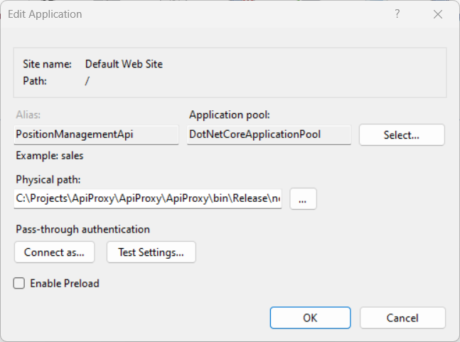
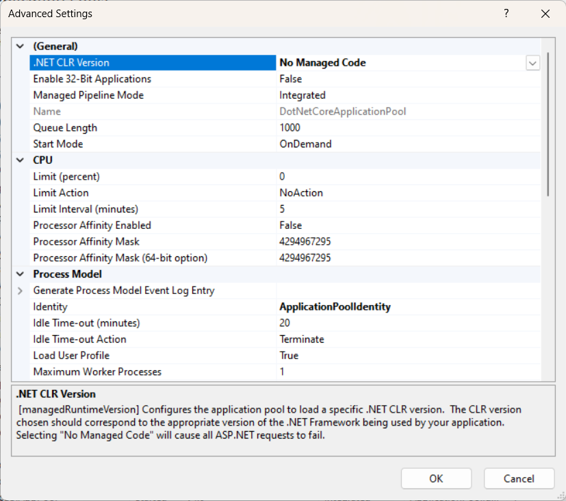

# Simple API proxy

This is an extremely simple proxy that I host on IIS and just forward requests to local Kestrel.

I chose this approach during the .NET Framework ➡️ dotnet6 migration because it gave me the freedom to switch between branches without the need to re-configure the application pool in IIS. 
I just needed to have one more page in IIS with the old .NET Framework and just by changing the configuration, I was able to forward requests either to the old .NET FW or Kestrel.

There are a couple more advantages that this approach
 - You never have problems with IIS deployments, like being unable to overwrite files
 - Debugging is literally about pressing F5 and it's almost instant
 - You don't need to run Rider as an administrator
 - You don't need deal ports at all

## IIS Setup

